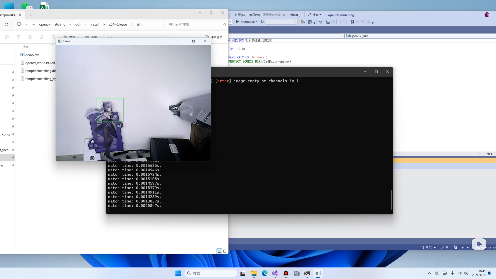
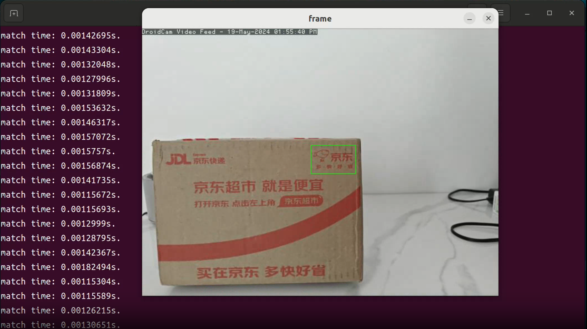

# Template Matching

- Based on [Fastest Image Pattern Matching](https://github.com/DennisLiu1993/Fastest_Image_Pattern_Matching)





## Improvements

1. Packaged as an easy-to-use library
2. Cross-platform adaptation
3. Enhanced macOS Apple Silicon support
4. Fixed compiler warnings for better code quality
5. Improved Python demo script with cross-platform compatibility

## Roadmap

- [ ] Optimize code structure
- [x] Python support

## Build Requirements

### General Requirements
- CMake 3.10 or higher
- C++17 compatible compiler
- OpenCV 4.x
- OpenMP (optional, for better performance)

### Platform Specific Requirements

#### Windows
- Visual Studio 2017/2019/2022 or MinGW
- OpenCV installed (placed in 3rdParty/opencv or system path)

#### Linux (Ubuntu/Debian example)
```shell
sudo apt-get update
sudo apt-get install libopencv-dev build-essential cmake
```

#### macOS
```shell
# Install Homebrew if not already installed
/bin/bash -c "$(curl -fsSL https://raw.githubusercontent.com/Homebrew/install/HEAD/install.sh)"

# Install dependencies
brew install opencv cmake libomp
```

Note: On macOS, OpenMP support requires `libomp` to be installed via Homebrew.

## Compilation

### Clone the code

When cloning with git, also clone submodules:

```shell
git clone --recurse-submodules https://github.com/acai66/opencv_matching.git
```

### Compile the code

#### Windows

Use various cmake compilation methods (vs2022, vs2019, vs2017, or cmake-gui) to compile. The demo uses vs2022 compilation, other tools for reference.

Compilation demo video: [Bilibili link](https://www.bilibili.com/video/BV1hu4m1F7D1)

#### Linux

Demonstrates compilation under Ubuntu 22.04, other distributions are similar:

1. Install dependencies and compilation tools

```shell
sudo apt-get update
sudo apt-get install libopencv-dev build-essential cmake
```

2. Navigate to the project root directory in the terminal and create a build folder

```shell
cd opencv_matching
mkdir build
cd build
```

3. cmake build

```shell
cmake -DCMAKE_INSTALL_PREFIX=./install ..
```

4. make compilation

```shell
make
```

5. Install

```shell
make install
```

#### macOS

The compilation process on macOS is similar to Linux, but with some differences in library extensions:

1. Install dependencies and compilation tools

```shell
# Install Homebrew if not already installed
/bin/bash -c "$(curl -fsSL https://raw.githubusercontent.com/Homebrew/install/HEAD/install.sh)"

# Install OpenCV and other dependencies
brew install opencv cmake libomp
```

2. Navigate to the project root directory and create a build folder

```shell
cd opencv_matching
mkdir build
cd build
```

3. cmake build

```shell
cmake -DCMAKE_INSTALL_PREFIX=./install ..
```

4. make compilation

```shell
make
```

5. Install

```shell
make install
```

## Directory Structure

After successful compilation, an `install` folder will be generated in the `build` directory, containing the compiled libraries (lib) and header files (include), as well as the `demo` executable (bin).

### Linux Directory Structure:

```shell
install
├── bin
│   └── demo
├── include
│   ├── matcher.h
│   └── templatematching.h
└── lib
    ├── libtemplatematching.so
    └── libtemplatematching_ctype.so
```

### macOS Directory Structure:

```shell
install
├── bin
│   └── demo
├── include
│   ├── matcher.h
│   └── templatematching.h
└── lib
    ├── libtemplatematching.dylib
    └── libtemplatematching_ctype.dylib
```

### Windows Directory Structure:

```shell
install
├── bin
│   ├── demo.exe
│   ├── opencv_world490.dll
│   ├── templatematching.dll
│   └── templatematching_ctype.dll
├── include
│   ├── matcher.h
│   └── templatematching.h
└── lib
    ├── templatematching.dll
    └── templatematching_ctype.dll
```

## Running the Demo

### Linux/macOS

To run `demo` in the `install/bin` directory, ensure that the library is in the run directory or in the system library path:

```shell
cd install/bin/
# For Linux:
cp ../lib/libtemplatematching.so ./
# For macOS:
cp ../lib/libtemplatematching.dylib ./
./demo
```

Alternatively, update the library path without copying the shared objects:

```shell
cd ~/Documents/GitHub/opencv-matching/build/install/bin
export LD_LIBRARY_PATH=$PWD:$LD_LIBRARY_PATH
./demo
```

### Windows

On Windows, the required DLLs are automatically copied to the bin directory during installation:

```shell
cd install/bin/
demo.exe
```

## Usage

Integrate the compiled library into other projects.

### C++

For C++ compilation, just include the header files. The library is loaded at runtime:

- Linux: `libtemplatematching.so`
- macOS: `libtemplatematching.dylib` 
- Windows: `templatematching.dll`

Refer to `demo.cpp` for detailed usage.

### Python

For Python usage, place the appropriate library files in the run directory. Refer to `py_demo.py` for demo code.

The updated `py_demo.py` script now includes:

1. **Cross-platform library loading**: Automatically detects the operating system and loads the appropriate library file
2. **Improved error handling**: Better error messages and handling for common issues
3. **Test image generation**: Creates test images when template files are not found
4. **Enhanced visualization**: Clear display of matching results with scores and positions

To run the Python demo:

```shell
cd install/bin/
# Copy the required libraries
cp ../lib/libtemplatematching.dylib ./  # macOS
cp ../lib/libtemplatematching_ctype.dylib ./  # macOS

# For Linux, use .so extensions instead
# For Windows, the DLLs should already be in the directory

python py_demo.py
```

The Python demo will:
- Create test template and target images if `image.png` is not found
- Set the template and perform matching
- Display results with bounding boxes and scores
- Save the result as `demo_result.png`

## Changes for macOS Apple Silicon Support

The following changes were made to ensure smooth operation on macOS Apple Silicon (M1/M2/M3) systems:

1. **Fixed Dynamic Library Loading**:
   - Updated `demo.cpp` to correctly load `.dylib` files on macOS instead of `.so` files
   - Added platform-specific library loading code that detects Apple Silicon and loads the appropriate library extension

2. **CMake Configuration Updates**:
   - Modified CMakeLists.txt to properly handle library extensions on macOS
   - Added proper linking for OpenMP on macOS with Apple Silicon

3. **Fixed Compiler Warnings**:
   - Resolved abstract class destructor warnings by adding virtual destructors to base classes
   - This ensures proper cleanup when deleting objects through base class pointers

4. **Memory Management Improvements**:
   - Updated virtual destructors in the inheritance hierarchy to prevent memory leaks
   - Matcher, BaseMatcher, and PatternMatcher classes now have proper virtual destructors

5. **Cross-Platform Compatibility**:
   - Maintained compatibility with existing Windows and Linux builds
   - Ensured that the codebase works consistently across all platforms

6. **Python Demo Improvements**:
   - Updated `py_demo.py` with cross-platform library path detection
   - Added better error handling and user feedback
   - Included test image generation for easier testing
   - Improved result visualization

These changes ensure that the template matching library builds and runs smoothly on macOS Apple Silicon systems while maintaining compatibility with other platforms.